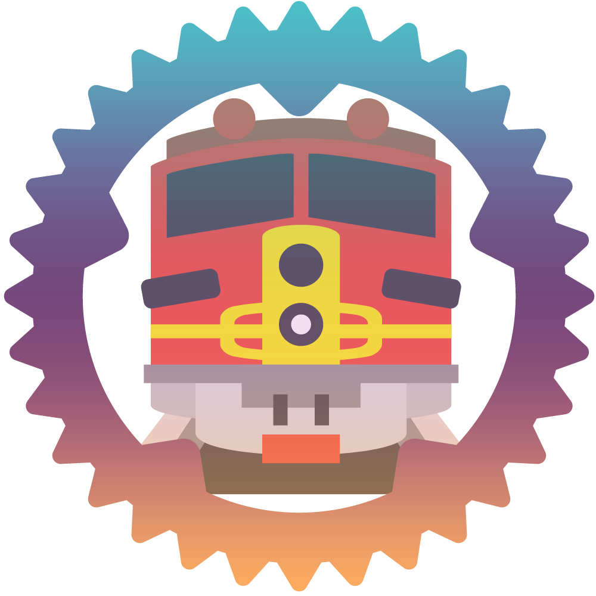

<p align="center">
  
</p>
<p align="center">
  <a href="https://github.com/BudiNverse/lta-rs">
    
  </a>
  <a href="https://github.com/BudiNverse/lta-rs">
    
  </a>
  <a href="https://dev.azure.com/budisyahiddin/lta-rs/_build?definitionId=6">
    
  </a>  
  <a href="https://crates.io/crates/lta">
    
  </a>
  <a href="https://github.com/BudiNverse/lta-rs">
    
  </a>
  <a href="https://github.com/BudiNverse/lta-rs">
    
  </a>
</p>

# lta-rs
> 🚍 Singapore LTA Datamall Rust Client written in pure rust with support for asynchronous requests. lta-rs is used to interact with the [lta-datamall](https://www.mytransport.sg/content/mytransport/home/dataMall.html)

## lta-rs in action

### Cargo.toml setup
```toml
[dependencies]
# features available: async, blocking. If you only need blocking requests, choose blocking vice versa.
lta = { version = "0.3.0", features = ["blocking", "async"] }
```

### API key setup
You can get your API key from [here](https://www.mytransport.sg/content/mytransport/home/dataMall/request-for-api.html)

```rust

use lta::prelude::*;

fn main() {
    let api_key = "MY_API_KEY";
    let client = LTAClient::with_api_key(api_key);
}
```

### Examples
<details>
    <summary>
    Getting bus timings    
    </summary>

```rust
use lta::prelude::*;
use lta::blocking::lta_client::LTAClient;
use lta::blocking::bus::get_arrival;

fn get_bus_arrival() -> LTAResult<()> {
    let api_key = std::env::var("API_KEY").expect("API_KEY not found!");
    let client = LTAClient::with_api_key(api_key);
    let arrivals: BusArrivalResp = get_arrival(&client, 83139, None)?;
    println!("{:?}", arrivals);
    Ok(())
}
```
    
</details>

<details>
    <summary>
    Getting other data
    </summary>
    
```rust
// All the APIs in this library are designed to be used like this
// `lta::blocking::module::get_something`
// All of them return lta::utils::LTAResult<Vec<T>>
// The example below is bus::get_bus_services()
// and traffic::get_erp_rates()
// Do note that the API calling convention is similar across all the APIs except for
// bus::get_arrival
// prefer lta::prelude::* over glob imports
// Most of the APIs returns only 500 record
// If you want to get records 501 - 1000 take a look at get_erp() example
use lta::prelude::*;
use lta::blocking::{
    lta_client::LTAClient,
    traffic::get_erp_rates,
    bus::get_bus_services,
};

fn bus_services() -> LTAResult<()> {
    let api_key = std::env::var("API_KEY").expect("API_KEY not found!");
    let client = LTAClient::with_api_key(api_key);
    let bus_services: Vec<BusService> = get_bus_services(&client, None)?;
    println!("{:?}", bus_services);
    Ok(())
}

fn get_erp() -> LTAResult<()> {
    let api_key = std::env::var("API_KEY").expect("API_KEY not found!");
    let client = LTAClient::with_api_key(api_key);
    let erp_rates: Vec<ErpRate> = get_erp_rates(&client, Some(500))?;
    println!("{:?}", erp_rates);
    Ok(())
}
```
    
</details>

### Async Example
<details>
    <summary>Using std::future and tokio</summary>
    
```rust
    use std::env;
    use lta::prelude::*;
    use lta::r#async::{
        bus::get_arrival,
        lta_client::LTAClient
    };
    
    #[tokio::main]
    async fn fut() -> LTAResult<()> {
        let api_key = env::var("API_KEY").expect("API_KEY must be set!");
        let client = LTAClient::with_api_key(api_key);
        let f1 = get_arrival(&client, 83139, None).await?;
        let f2 = get_arrival(&client, 83139, None).await?;
        println!("{:?} \n{:?}", f1, f2);
        Ok(())
    }
```
    
</details>

### Custom Client
<details>
    <summary>
    There are some instances where you might need to customise the reqwest client due to certain limitations.
    </summary>

```rust
use lta::prelude::*;
use std::time::Duration;
use lta::utils::reqwest::blocking::ClientBuilder;
use lta::blocking::lta_client::LTAClient;

fn my_custom_client() -> LTAClient {
    let client = ClientBuilder::new()
        .no_gzip()
        .connect_timeout(Some(Duration::new(420,0)))
        .build()
        .unwrap();

    LTAClient::new(Some("api_key".to_string()), client)
}
 ```
    
</details>

### Concurrent requests without `Futures`
<details>
    <summary>
    Using normal threads
    </summary>

```rust
use std::sync::Arc;
use std::thread::spawn;
use lta::blocking::{
    lta_client::LTAClient,
    traffic::get_carpark_avail,
};
use lta::prelude::*;

fn concurrent() {
    let api_key = env::var("API_KEY").unwrap();
    let c1 = Arc::new(LTAClient::with_api_key(api_key));
    let c2 = c1.clone();

    let child = spawn(move || {
        let res = get_carpark_avail(&c1, None).unwrap();
        println!("{:?}", res)
    });

    let vms = traffic::get_vms_emas(&c2, None).unwrap();
    println!("{:?}", vms);

    child.join();
}
```    
    
</details>

### General advice
- Reuse `LTAClient` as it holds a connection pool internally
- Reduce the number of times you call the API, take a look at `Update Freq` in the documentation and prevent
yourself from getting blacklisted. Use a caching mechanism. 
- Prefer `async` APIs over writing your own implementations for concurrent requests.

### Getting help
- You can get help via GitHub issues. I will try my best to respond to your queries :smile:

### Design decisions
- Made sure that Rust structs are as close to the original response as possible so that people can reference the original docs if there are any issues 
- Simple and no additional baggage. Only the client is included. E.g If anyone wants to add concurrency, they have to do it on their own
- Predictable API usage

### Changelog
> Changelog can be found [here](./CHANGELOG.md)

### Requirements
On Linux:

- OpenSSL 1.0.1, 1.0.2, or 1.1.0 with headers (see https://github.com/sfackler/rust-openssl)

On Windows and macOS:

- Nothing.

lta-rs uses [rust-native-tls](https://github.com/sfackler/rust-native-tls) internally, which will use the operating system TLS framework if available, meaning Windows and macOS. On Linux, it will use OpenSSL 1.1.

### Todo (excluding bugs from issues)
- [x] Proper date types using chrono library
- [x] Utils cleanup
- [x] Host on crates.io
- [ ] Static website to showcase project
- [x] Documentation
- [x] More idiomatic Rust code
- [x] Asynchronous requests 
- [x] AzurePipelines
- [x] Documentation for async
- [x] `std::future`
- [x] Customisable `Client`
- [x] Better testing, reduce API spam and cache data for testing
- [ ] Deserialization benchmark

### License
lta-rs is licensed under MIT license (LICENSE-MIT or http://opensource.org/licenses/MIT)

### Frequently Asked Questions

> Is this library being actively developed?

Yes. However, development will slow down from mid August 2019 onwards due to my NS commitments.

> What are the APIs available?

Take a look at the official LTA docs.

> Where do I get the official docs from lta?

You can get them [here](https://www.mytransport.sg/content/dam/datamall/datasets/LTA_DataMall_API_User_Guide.pdf)
